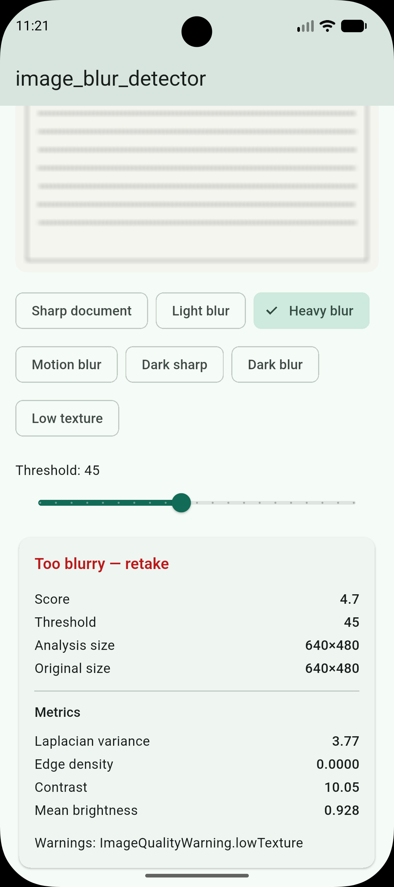

# blur_check

[](https://github.com/iZenrix/blur-check/actions/workflows/ci.yml)
[](https://pub.dev/packages/blur_check)
[](https://github.com/iZenrix/blur-check/blob/main/LICENSE)

Offline image blur/sharpness detection for Flutter using classical image
processing — no ML Kit, no TensorFlow Lite, no network.

`blur_check` estimates image sharpness using local high-frequency
information, primarily **Variance of Laplacian**, combined with lightweight
image-quality metrics. The returned score is intended for application-level
quality checks and should be calibrated for each use case.

- **Repository:** [github.com/iZenrix/blur-check](https://github.com/iZenrix/blur-check)
- **Issues:** [github.com/iZenrix/blur-check/issues](https://github.com/iZenrix/blur-check/issues)
- **pub.dev:** [pub.dev/packages/blur_check](https://pub.dev/packages/blur_check)

## Screenshot

Example app — heavy blur sample, score **4.7** vs threshold **45**:

<p align="center">
  
</p>

## Features

- Analyze JPEG/PNG (and WebP when supported by the `image` package)
- Inputs: `Uint8List` bytes or file path
- Normalized sharpness score `0..100` (higher = sharper)
- Configurable threshold → `isBlurred`
- Raw metrics: Laplacian variance, edge density, contrast, brightness
- Warnings: `tooDark`, `tooBright`, `lowTexture`
- Optional background isolate for async APIs
- Fully on-device — no image upload

## Installation

```yaml
dependencies:
  blur_check: ^0.1.0
```

```bash
flutter pub get
```

## Quick start

```dart
import 'package:blur_check/blur_check.dart';

final result = await BlurDetector().analyzeBytes(imageBytes);

if (result.isBlurred) {
  // Ask the user to retake the photo.
  print('Sharpness score: ${result.score}');
}
```

With configuration:

```dart
final detector = BlurDetector(
  config: const BlurDetectorConfig(
    threshold: 50,
    maxAnalysisDimension: 720,
    useIsolate: true,
  ),
);

final result = await detector.analyzeBytes(bytes);
print(result.metrics);
print(result.warnings);
```

Analyze from a file path (not available on web):

```dart
final result = await BlurDetector().analyzeFile('/path/to/photo.jpg');
```

## How it works

```text
Image → decode → EXIF orientation → resize → grayscale
      → Laplacian variance + edge density + contrast + brightness
      → normalized score 0..100 → threshold → isBlurred
```

Default composite score weights (baseline calibration, not universal truth):

| Component | Weight |
|-----------|--------|
| Normalized Laplacian variance | 75% |
| Edge density | 15% |
| Contrast | 10% |

Score bands (UX guidance only):

| Range | Hint |
|-------|------|
| 0–25 | very blurry |
| 25–45 | blurry |
| 45–65 | acceptable |
| 65–85 | sharp |
| 85–100 | very sharp |

## Threshold calibration

The default threshold (`45`) is a **starting point**. Calibrate with photos
from your real camera / use case:

1. Collect 100–500 labeled photos (`acceptable` / `blurred`)
2. Run the detector and export `score` + metrics
3. Pick a threshold that balances false positives vs false negatives

Guidance:

- **Document / OCR** — higher threshold (reject soft images early)
- **General camera** — medium threshold
- **Fast preview** — lower threshold

For OCR, accepting a blurry photo (false negative) is usually worse than
asking the user to retake.

## Performance

Analysis runs on a resized copy (default longest side **720px**).

Run the local benchmark harness:

```bash
dart run benchmark/blur_detector_benchmark.dart
```

Async APIs may offload work with `Isolate.run` when `useIsolate` is enabled
and the payload is at least `isolateMinBytes` (default 64KB). Web falls back
to the calling isolate.

## Platform support

| Platform | Support | Notes |
|----------|---------|-------|
| Android | ✅ | Primary target |
| iOS | ✅ | Primary target |
| macOS / Windows / Linux | ✅ | Via pure-Dart core |
| Web | ⚠️ | Use `analyzeBytes`; no `analyzeFile` (`dart:io`) |

## Privacy

No image is uploaded by this package. All blur analysis is performed on-device.

## Limitations

Classical blur detection can mis-score:

- low-texture scenes (plain wall, sky)
- very dark or noisy images
- intentional bokeh / subject blur with sharp background
- artistic motion blur

Do not treat the score as overall photo quality or a calibrated probability.
Use `warnings` (especially `lowTexture`) when explaining low scores to users.

## Example app

```bash
git clone https://github.com/iZenrix/blur-check.git
cd blur-check/example
flutter pub get
flutter run
```

## Development

```bash
dart format .
flutter analyze
flutter test
dart run tool/generate_fixtures.dart
dart run benchmark/blur_detector_benchmark.dart
```

## Contributing

Issues and pull requests are welcome on
[GitHub](https://github.com/iZenrix/blur-check/issues).

## License

MIT — see [LICENSE](LICENSE).
